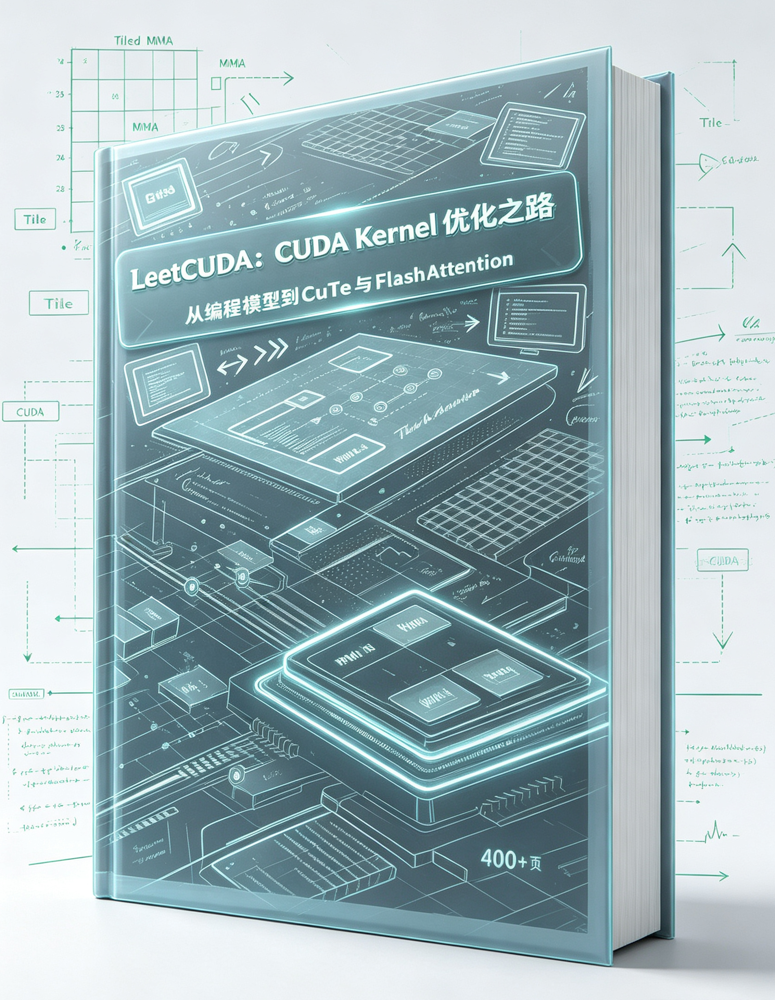

<div align="center">
  <div align='center'>
      
  </div>
</div>

## 📖 快速开始 🔥🔥

```bash
git clone https://github.com/xlite-dev/LeetCUDA.git && cd LeetCUDA
git submodule update --init --recursive --force && cd kernels/interview
# Install the latest CUDNN library for benchmarks (remove the old version first)
apt remove -y libcudnn9-cuda-13 libcudnn9-dev-cuda-13 libcudnn9-headers-cuda-13 
apt install -y cudnn9-cuda-13 ccache # Also install ccache for faster rebuilds

# Build for target architecture (ccache accelerated when available):
./build.sh --arch sm_89     # Ada Lovelace (L20, RTX 40 series, CUDA Toolkit >= 13.2)
./build.sh --arch sm_90a    # Hopper (H100/H200, CUDA Toolkit >= 13.2)
./build.sh --arch sm_120a   # Blackwell (RTX 5090 / PRO 5000/6000, CUDA Toolkit >= 13.2)
./build.sh --arch all       # All three architectures (sm_89, sm_90a, sm_120a)
./build.sh --clean          # Remove build artifacts (*.o, *.bin, *.ptx)
```

```bash
# Then, run the notes_v2_sm120a.bin with bench mode (e.g., NVIDIA RTX 5090, Blackwell SM_120a)
# Baseline: cuBLAS v13.3.0.5-1 (290T); cuDNN v9.25.0.15 SDPA (222T), PyTorch v2.11 SDPA (210T)
# Speedup: Flash-Attention 2/3 -> ~1.37x (F16 Acc vs cuDNN), ~1.01x (F32 Acc vs cuDNN), ~1.07x
# (F32 Acc vs PyTorch SDPA); HGEMM w/ Pipe & SMEM & Block Swizzle -> 1.07x (F16 Acc vs cuBLAS)
./notes_v2_sm120a.bin --bench --mnk 4096,4096,4096 --bhnd 1,32,16384,128 # MMA ACC F16/F32 Acc
| Kernel                                                   | Max Err   | TFLOPS/cu{BLAS,DNN} |
|----------------------------------------------------------|-----------|---------------------|
| HGEMM CuTe Swizzle (S=2, BLK_SW=0)                       | 0.000e+00 | 307.7/295.4 (1.04x) |
| HGEMM CuTe Swizzle (S=2, BLK_SW=1)                       | 0.000e+00 | 307.3/295.4 (1.04x) |
| HGEMM CuTe Swizzle (S=3, BLK_SW=0)                       | 0.000e+00 | 315.3/295.4 (1.07x) |
| HGEMM CuTe Swizzle (S=3, BLK_SW=1)                       | 0.000e+00 | 317.4/295.4 (1.07x) |
| FA2 MMA Stages (Sk=1, Pad, F16Acc)                       | 1.831e-04 | 220.2/222.9 (0.99x) |
| FA2 MMA Stages (Sk=2, Pad, F16Acc)                       | 1.831e-04 | 254.7/222.9 (1.14x) |
| FA2 MMA Stages (Sk=1, Pad, F32Acc)                       | 1.526e-05 | 165.6/221.6 (0.75x) |
| FA2 MMA Stages (Sk=2, Pad, F32Acc)                       | 1.526e-05 | 180.1/221.6 (0.81x) |
| FA2 CuTe MMA Stages (Sk=1, F32Acc)                       | 1.526e-05 | 199.0/221.6 (0.90x) |
| FA2 CuTe MMA Stages (Sk=2, F32Acc)                       | 1.526e-05 | 201.2/221.6 (0.91x) |
| FA2 TMA MMA WS (1 Consumer WG) (Sk=1, Sv=1, F16Acc)      | 1.831e-04 | 262.5/222.9 (1.18x) |
| FA2 TMA MMA WS (1 Consumer WG) (Sk=2, Sv=1, F16Acc)      | 1.831e-04 | 292.0/222.9 (1.31x) |
| FA2 TMA MMA WS (1 Consumer WG) (Sk=3, Sv=1, F16Acc)      | 1.831e-04 | 296.9/222.9 (1.33x) |
| FA2 TMA MMA WS (1 Consumer WG) (Sk=2, Sv=1, F32Acc)      | 1.526e-05 | 201.9/221.6 (0.91x) |
| FA2 TMA MMA WS (1 Consumer WG) (Sk=3, Sv=1, F32Acc)      | 1.526e-05 | 202.2/221.6 (0.91x) |
| FA3 TMA MMA WS (2 Consumer WG) (Sk=1, Sv=1, F16Acc)      | 9.155e-05 | 305.2/222.9 (1.37x) |
| FA3 TMA MMA WS (2 Consumer WG) (Sk=1, Sv=1, F32Acc)      | 1.526e-05 | 212.0/221.6 (0.96x) |
| FA2 CuTe TMA MMA WS (1 Consumer WG) (Sk=2, Sv=1, F32Acc) | 1.526e-05 | 220.8/221.6 (1.00x) |
| FA2 CuTe TMA MMA WS (1 Consumer WG) (Sk=3, Sv=1, F32Acc) | 1.526e-05 | 222.8/221.6 (1.01x) |
# Speedup: Split-D for large headdim (e.g, D=320) ~2.20x faster than cuDNN SDPA (with F32 Acc)
./notes_v2_sm120a.bin --bench --bhnd 1,32,16384,320 # Split-D for large headdims (e.g, D=320)
| Kernel                                                   | Max Err   | TFLOPS/cu{BLAS,DNN} |
|----------------------------------------------------------|-----------|---------------------|
| FA Split-D CuTe TMA MMA WS (D=320, Sk=1, Sv=1)           | 1.526e-05 | 127.2/83.1 (1.53x)  |
| FA Split-D CuTe TMA MMA WS (D=320, Sk=2, Sv=2)           | 1.526e-05 | 182.6/83.1 (2.20x)  |
```
