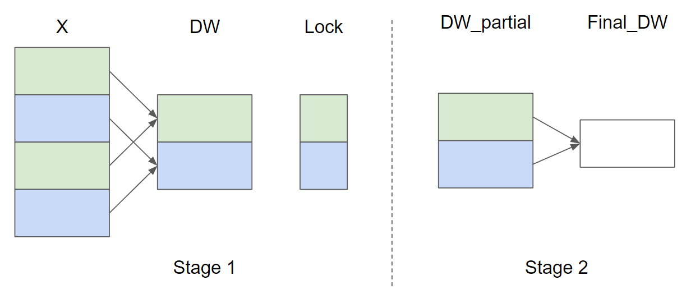
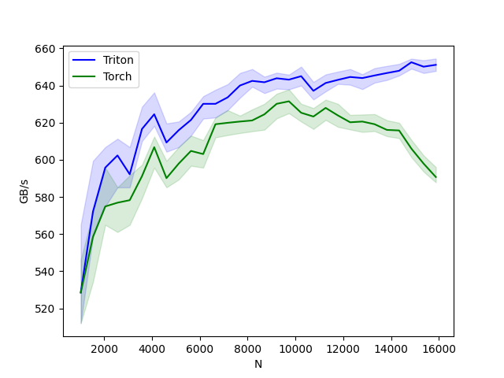
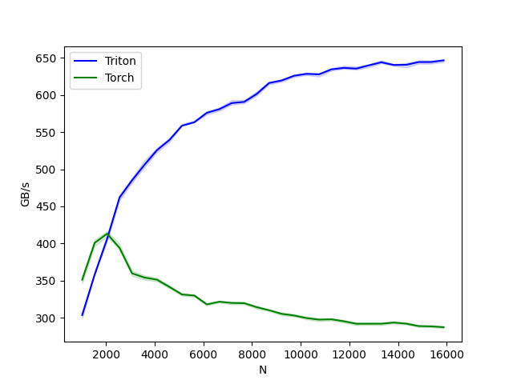

# Fused Layer Norm

## Forward pass

The *LayerNorm* operator was first introduced is a way to improve the performance of sequential models (e.g., Transformers) or neural networks with small batch size.
It takes a vector $x$ as input and produces a vector $y$ of the same shape as output.
The normalization is performed by subtracting the mean and dividing by the standard deviation of $x$.
After the normalization, a learnable linear transformation with weights $w$ and biases $b$ is applied.

The forward pass can be expressed as follows:

$$y = \frac{ x - \text{E}[x] }{ \sqrt{\text{Var}(x) + \epsilon} } * w + b$$

where $\epsilon$ is a small constant added to the denominator for numerical stability.


```python
@triton.jit
def _layer_norm_fwd_fused(
    X,  # pointer to the input
    Y,  # pointer to the output
    W,  # pointer to the weights
    B,  # pointer to the biases
    Mean,  # pointer to the mean
    Rstd,  # pointer to the 1/std
    stride,  # how much to increase the pointer when moving by 1 row
    N,  # number of columns in X
    eps,  # epsilon to avoid division by zero
    BLOCK_SIZE: tl.constexpr,
):
    # Map the program id to the row of X and Y it should compute.
    row = tl.program_id(0)
    Y += row * stride
    X += row * stride
    # Compute mean
    mean = 0
    _mean = tl.zeros([BLOCK_SIZE], dtype=tl.float32)
    for off in range(0, N, BLOCK_SIZE):
        cols = off + tl.arange(0, BLOCK_SIZE)
        a = tl.load(X + cols, mask=cols < N, other=0.0).to(tl.float32)
        _mean += a
    mean = tl.sum(_mean, axis=0) / N
    # Compute variance
    _var = tl.zeros([BLOCK_SIZE], dtype=tl.float32)
    for off in range(0, N, BLOCK_SIZE):
        cols = off + tl.arange(0, BLOCK_SIZE)
        x = tl.load(X + cols, mask=cols < N, other=0.0).to(tl.float32)
        x = tl.where(cols < N, x - mean, 0.0)
        _var += x * x
    var = tl.sum(_var, axis=0) / N
    rstd = 1 / tl.sqrt(var + eps)
    # Write mean / rstd
    tl.store(Mean + row, mean)
    tl.store(Rstd + row, rstd)
    # Normalize and apply linear transformation
    for off in range(0, N, BLOCK_SIZE):
        cols = off + tl.arange(0, BLOCK_SIZE)
        mask = cols < N
        w = tl.load(W + cols, mask=mask)
        b = tl.load(B + cols, mask=mask)
        x = tl.load(X + cols, mask=mask, other=0.0).to(tl.float32)
        x_hat = (x - mean) * rstd
        y = x_hat * w + b
        # Write output
        tl.store(Y + cols, y, mask=mask)
```

## Backward pass

The backward pass for the layer normalization operator is a bit more involved than the forward pass.
Let $\hat{x}$ be the normalized inputs $\frac{ x - \text{E}[x] }{ \sqrt{\text{Var}(x) + \epsilon} }$ before the linear transformation,
the Vector-Jacobian Products (VJP) $\nabla_{x}$ of $x$ are given by:

$$\nabla_{x}=\frac{1}{\sigma}\Big( \nabla_{y}\odot w - \underbrace{ \big( \frac{1}{N} \hat{x}\cdot(\nabla_{y}\odot w) \big) }_{c_1}\odot \hat{x} - \underbrace{ \frac{1}{N} \nabla_{y}\cdot w }_{c_2} \Big)$$


where $\odot$ denotes the element-wise multiplication, $\cdot$ denotes the dot product, and $\sigma$ is the standard deviation.
$c_1$ and $c_2$ are intermediate constants that improve the readability of the following implementation.

For the weights $w$ and biases $b$, the VJPs $\nabla_{w}$ and $\nabla_{b}$ are more straightforward:

$$\nabla_{w} = \nabla_{y} \odot \hat{x} \quad \text{and} \quad \nabla_{b} = \nabla_{y}$$

Since the same weights $w$ and biases $b$ are used for all rows in the same batch, their gradients need to sum up.
To perform this step efficiently, we use a parallel reduction strategy: each kernel instance accumulates
partial $\nabla_{w}$ and $\nabla_{b}$ across certain rows into one of `GROUP_SIZE_M` independent buffers.

These buffers stay in the L2 cache and then are further reduced by another function to compute the actual $\nabla_{w}$ and $\nabla_{b}$.

Let the number of input rows $M = 4$ and GROUP_SIZE_M = 2, here's a diagram of the parallel reduction strategy for $\nabla_{w}$ ($\nabla_{b}$ is omitted for brevity):



In Stage 1, the rows of X that have the same color share the same buffer and thus a lock is used to ensure that only one kernel instance writes to the buffer at a time.
In Stage 2, the buffers are further reduced to compute the final $\nabla_{w}$ and $\nabla_{b}$.
In the following implementation, Stage 1 is implemented by the function `_layer_norm_bwd_dx_fused` and Stage 2 is implemented by the function `_layer_norm_bwd_dwdb$`

```python
@triton.jit
def _layer_norm_bwd_dx_fused(
    DX,  # pointer to the input gradient
    DY,  # pointer to the output gradient
    DW,  # pointer to the partial sum of weights gradient
    DB,  # pointer to the partial sum of biases gradient
    X,  # pointer to the input
    W,  # pointer to the weights
    Mean,  # pointer to the mean
    Rstd,  # pointer to the 1/std
    Lock,  # pointer to the lock
    stride,  # how much to increase the pointer when moving by 1 row
    N,  # number of columns in X
    GROUP_SIZE_M: tl.constexpr,
    BLOCK_SIZE_N: tl.constexpr,
):
    # Map the program id to the elements of X, DX, and DY it should compute.
    row = tl.program_id(0)
    cols = tl.arange(0, BLOCK_SIZE_N)
    mask = cols < N
    X += row * stride
    DY += row * stride
    DX += row * stride
    # Offset locks and weights/biases gradient pointer for parallel reduction
    lock_id = row % GROUP_SIZE_M
    Lock += lock_id
    Count = Lock + GROUP_SIZE_M
    DW = DW + lock_id * N + cols
    DB = DB + lock_id * N + cols
    # Load data to SRAM
    x = tl.load(X + cols, mask=mask, other=0).to(tl.float32)
    dy = tl.load(DY + cols, mask=mask, other=0).to(tl.float32)
    w = tl.load(W + cols, mask=mask).to(tl.float32)
    mean = tl.load(Mean + row)
    rstd = tl.load(Rstd + row)
    # Compute dx
    xhat = (x - mean) * rstd
    wdy = w * dy
    xhat = tl.where(mask, xhat, 0.0)
    wdy = tl.where(mask, wdy, 0.0)
    c1 = tl.sum(xhat * wdy, axis=0) / N
    c2 = tl.sum(wdy, axis=0) / N
    dx = (wdy - (xhat * c1 + c2)) * rstd
    # Write dx
    tl.store(DX + cols, dx, mask=mask)
    # Accumulate partial sums for dw/db
    partial_dw = (dy * xhat).to(w.dtype)
    partial_db = (dy).to(w.dtype)
    while tl.atomic_cas(Lock, 0, 1) == 1:
        pass
    count = tl.load(Count)
    # First store doesn't accumulate
    if count == 0:
        tl.atomic_xchg(Count, 1)
    else:
        partial_dw += tl.load(DW, mask=mask)
        partial_db += tl.load(DB, mask=mask)
    tl.store(DW, partial_dw, mask=mask)
    tl.store(DB, partial_db, mask=mask)

    # need a barrier to ensure all threads finished before
    # releasing the lock
    tl.debug_barrier()

    # Release the lock
    tl.atomic_xchg(Lock, 0)


@triton.jit
def _layer_norm_bwd_dwdb(
    DW,  # pointer to the partial sum of weights gradient
    DB,  # pointer to the partial sum of biases gradient
    FINAL_DW,  # pointer to the weights gradient
    FINAL_DB,  # pointer to the biases gradient
    M,  # GROUP_SIZE_M
    N,  # number of columns
    BLOCK_SIZE_M: tl.constexpr,
    BLOCK_SIZE_N: tl.constexpr,
):
    # Map the program id to the elements of DW and DB it should compute.
    pid = tl.program_id(0)
    cols = pid * BLOCK_SIZE_N + tl.arange(0, BLOCK_SIZE_N)
    dw = tl.zeros((BLOCK_SIZE_M, BLOCK_SIZE_N), dtype=tl.float32)
    db = tl.zeros((BLOCK_SIZE_M, BLOCK_SIZE_N), dtype=tl.float32)
    # Iterate through the rows of DW and DB to sum the partial sums.
    for i in range(0, M, BLOCK_SIZE_M):
        rows = i + tl.arange(0, BLOCK_SIZE_M)
        mask = (rows[:, None] < M) & (cols[None, :] < N)
        offs = rows[:, None] * N + cols[None, :]
        dw += tl.load(DW + offs, mask=mask, other=0.0)
        db += tl.load(DB + offs, mask=mask, other=0.0)
    # Write the final sum to the output.
    sum_dw = tl.sum(dw, axis=0)
    sum_db = tl.sum(db, axis=0)
    tl.store(FINAL_DW + cols, sum_dw, mask=cols < N)
    tl.store(FINAL_DB + cols, sum_db, mask=cols < N)
```

## Benchmark

### Forward pass

```bash
python3 triton_layer_norm.py --mode forward
layer-norm-forward:
          N      Triton       Torch
0    1024.0  528.516136  528.516136
1    1536.0  572.158608  558.545450
2    2048.0  595.781814  574.877182
3    2560.0  602.352931  576.901391
4    3072.0  592.192778  578.258826
5    3584.0  616.602135  591.175279
6    4096.0  624.524129  606.814814
7    4608.0  609.322328  590.119034
8    5120.0  615.939877  597.956224
9    5632.0  621.462077  604.778525
10   6144.0  630.153868  603.092009
11   6656.0  630.153823  619.162791
12   7168.0  633.635374  619.935145
13   7680.0  639.999977  620.606079
14   8192.0  642.509816  621.194295
15   8704.0  641.769605  624.502255
16   9216.0  643.912671  630.153829
17   9728.0  643.173568  631.512128
18  10240.0  645.039336  625.343543
19  10752.0  637.155580  623.304334
20  11264.0  641.366580  627.958183
21  11776.0  643.058042  623.894039
22  12288.0  644.616406  620.214515
23  12800.0  644.025146  620.606042
24  13312.0  645.430284  619.162791
25  13824.0  646.736816  616.111424
26  14336.0  647.954823  615.800311
27  14848.0  652.547309  606.040836
28  15360.0  650.158735  597.956224
29  15872.0  651.158973  590.714847
```


### Backward pass

```bash
python3 triton_layer_norm.py --mode backward
layer-norm-backward:
          N      Triton       Torch
0    1024.0  303.407414  351.085705
1    1536.0  357.902918  400.695643
2    2048.0  406.214885  413.042029
3    2560.0  461.954908  393.846167
4    3072.0  485.052653  359.648774
5    3584.0  505.976473  353.975305
6    4096.0  525.689846  351.085705
7    4608.0  539.473160  341.333340
8    5120.0  558.545450  331.212936
9    5632.0  563.310028  329.678042
10   6144.0  576.000001  317.793096
11   6656.0  580.887276  321.416498
12   7168.0  589.150662  319.762069
13   7680.0  590.769251  319.445392
14   8192.0  601.362644  314.070291
15   8704.0  616.212406  309.934714
16   9216.0  619.563005  305.068231
17   9728.0  625.930315  302.817124
18  10240.0  628.542186  299.342257
19  10752.0  627.854035  297.290332
20  11264.0  634.591530  297.726876
21  11776.0  636.540534  295.014608
22  12288.0  635.586191  291.703260
23  12800.0  640.000016  291.737896
24  13312.0  644.129041  291.769875
25  13824.0  640.494226  293.347481
26  14336.0  640.715067  291.834720
27  14848.0  644.397807  288.544136
28  15360.0  644.475536  288.225185
29  15872.0  646.736839  287.059538
```



## Reference

[Jimmy Lei Ba and Jamie Ryan Kiros and Geoffrey E. Hinton, "Layer Normalization", Arxiv 2016](https://arxiv.org/abs/1607.06450)
